```mermaid
flowchart LR
    CLI["praisonaibench --suite tests.yaml --format csv"]
    CLI --> B[Bench]
    B --> R[Results]
    R --> CSV["results.csv
    ─────────────────
    test,model,score,time
    cube,gpt-4o,92,8.2s
    solar,gpt-4o,85,12.1s"]
```

# Potential New Features for PraisonAI Bench

Based on analysis of the current codebase, PRD roadmap, and industry best practices from 2024/2025, here are the most valuable features to consider:

---

## High Priority (High Impact, Aligns with PRD Phase 3-4)

### 1. Parallel/Concurrent Test Execution

- **Why**: PRD mentions `--concurrent` flag but it's not implemented. Would significantly speed up test suites.
- **Implementation**: Use `asyncio` or `concurrent.futures` in `bench.py`
- **Effort**: Medium

### 2. Cost & Token Usage Tracking

- **Why**: Essential for budget management when benchmarking. Industry standard feature.
- **What**: Track input/output tokens, calculate cost per model, show cumulative costs
- **Location**: Add to `agent.py` and results JSON
- **Effort**: Low (LiteLLM provides token counts)

### 3. HTML Dashboard/Report Generation

- **Why**: Visual comparison across models and tests. Mentioned in PRD Phase 4.
- **What**: Generate `report.html` with charts (pass rates, latencies, scores by model)
- **Effort**: Medium

```mermaid
flowchart LR
    subgraph Input
        J1[results_gpt4.json]
        J2[results_claude.json]
        J3[results_grok.json]
    end
    
    subgraph Generator["Report Generator"]
        T[Template Engine]
        C[Chart.js Data]
    end
    
    subgraph Output["report.html"]
        D1[📊 Score Comparison Chart]
        D2[⏱️ Latency Chart]
        D3[💰 Cost Breakdown]
        D4[✅ Pass/Fail Table]
    end
    
    J1 & J2 & J3 --> Generator --> Output
```

### 4. CSV Export

- **Why**: Mentioned in PRD Phase 3. Enables spreadsheet analysis.
- **Implementation**: Add `--format csv` option to CLI
- **Effort**: Low

---

## Medium Priority (Valuable Enhancements)

### 5. CI/CD Integration Helpers

- **Why**: PRD targets DevOps engineers. Makes pipeline integration seamless.
- **What**: 
  - Exit code based on pass/fail threshold
  - GitHub Actions workflow template
  - JUnit XML output format
- **Effort**: Low-Medium

### 6. Latency Metrics (Time to First Token, Tokens/sec)

- **Why**: Critical for production decisions. Industry standard metric.
- **What**: Add TTFT, tokens/second, P50/P90/P99 latencies
- **Effort**: Low (requires streaming support)

### 7. Progress Bar & ETA

- **Why**: PRD mentions progress reporting. Better UX for long suites.
- **What**: Use `tqdm` or `rich` for visual progress
- **Effort**: Low

### 8. Category/Tag Filtering

- **Why**: YAML schema already supports `category` field but filtering not implemented
- **What**: Add `--category summarisation` CLI option
- **Effort**: Low

### 9. Diff/Regression Comparison

- **Why**: Compare benchmark runs over time, detect regressions
- **What**: `praisonaibench --compare results1.json results2.json`
- **Effort**: Medium

### 10. Response Caching (Development Mode)

- **Why**: Avoid duplicate API calls during test development
- **What**: Cache responses by prompt hash, `--cache` flag
- **Effort**: Medium

---

## Lower Priority (Nice to Have)

### 11. Multi-language Code Evaluation

- **Why**: Currently focused on HTML/JS. Python, TypeScript generation is common.
- **What**: Add Python execution evaluator, syntax checking
- **Effort**: High

### 12. Accessibility Testing

- **Why**: FrontendBench research emphasises accessibility
- **What**: Integrate axe-core for a11y scoring
- **Effort**: Medium

### 13. Security Scanning

- **Why**: Important for production code generation
- **What**: Basic XSS/injection detection in generated code
- **Effort**: Medium

### 14. Config Profiles

- **Why**: Named configs for different testing scenarios
- **What**: `praisonaibench --profile production`
- **Effort**: Low

### 15. Plugin/Custom Evaluator System

- **Why**: Extensibility for domain-specific evaluation
- **What**: Register custom evaluator classes
- **Effort**: High

---

## Quick Wins (Low Effort, Immediate Value)

| Feature | Effort | Impact |

|---------|--------|--------|

| CSV export | 1-2 hours | Medium |

| Exit codes for CI | 30 mins | Medium |

| Category filtering | 1 hour | Low |

| Progress bar | 1 hour | Medium |

| Token tracking | 2 hours | High |

---

## Recommended Implementation Order

1. **Token/Cost tracking** - Low effort, high value
2. **CSV export** - Low effort, in PRD
3. **CI exit codes** - Low effort, enables automation
4. **Progress bar** - Low effort, better UX
5. **Parallel execution** - Medium effort, significant speedup
6. **HTML dashboard** - Medium effort, showcase feature